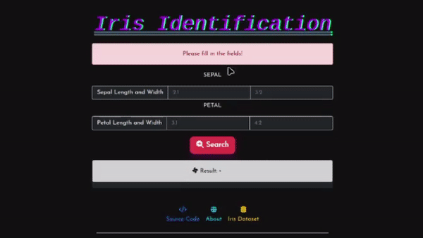
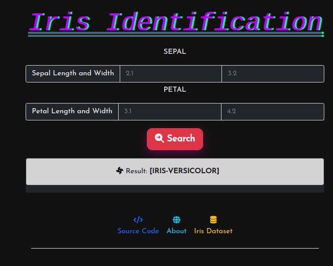

<h1 align='center'>Python Iris Identification</h1>
<a align='center'target="_blank" href="https://iris-identification.herokuapp.com/"></a>

<p align='center'>Basic Iris Identification website built in django web framework using Python.</p>
<p align='center' style="font-style: italic;">Dataset: https://archive.ics.uci.edu/ml/machine-learning-databases/iris/</p>


<p align="center">
    <a href="https://iris-identification.herokuapp.com/">
        
    </a>
</p>

<p align='center'>
    
</p>


## Requirements
You can install the Requirements by running the command:

```
pip install -r requirements.txt
```

```
asgiref==3.5.0
Django==4.0.4
joblib==1.1.0
numpy==1.22.3
pandas==1.4.2
python-dateutil==2.8.2
pytz==2022.1
scikit-learn==1.0.2
scipy==1.8.0
six==1.16.0
sklearn==0.0
sqlparse==0.4.2
threadpoolctl==3.1.0
```

## Installation
```sh
$ git clone https://github.com/alii76tt/iris-identification
$ cd iris-identification
$ pip install -r requirements.txt
$ python manage.py runserver
```

## Screenshot
<p align='center'>
    
</p>
